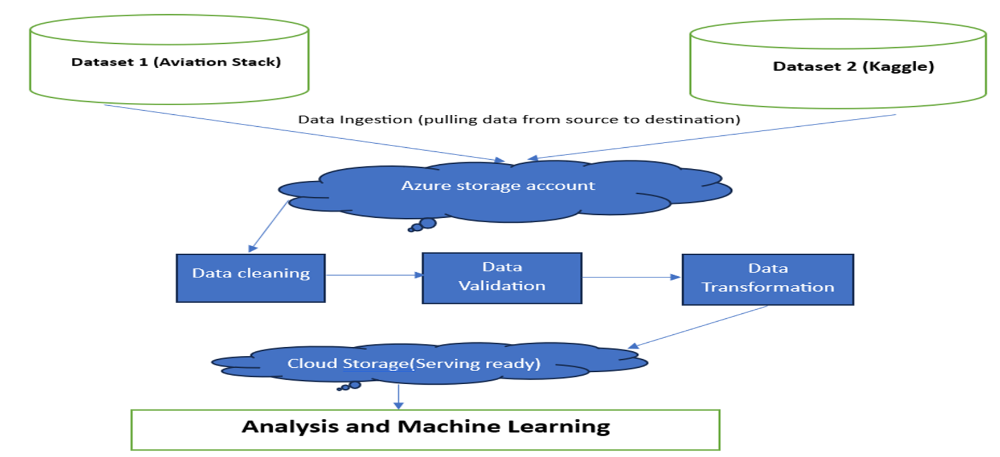

# Data Engineering and Machine Learning Project

Welcome to the 
Fundamentals of Data Engineering Project! This project aims to provide a comprehensive data engineering solution for analyzing the airlines performance in future based on two dynamic datasets, 
along with descriptive analysis. Below, you'll find an overview of the project, the datasets used, and the ingestion process.

## Project Overview and roadmap
The name of the project is A Sky of flight analysis using machine learning
The project focuses on ingesting, processing, and cleaning two distinct dynamic datasets, making them ready for serving, and applying machine learning for predictive analysis. It is designed to showcase a complete data engineering and machine learning. The project follows a structured approach with the following main phases:

1. **Data Ingestion:** Fetching data from multiple sources and preparing it for processing.

2. **Data Preprocessing:** Cleaning and transforming the data, which includes handling missing values.

3. **Modeling and Machine Learning:** Applying machine learning techniques to the prepared data for predictive analysis.

## Datasets

### Dataset 1

- **Airlines delay dataset from Kaggle:** The first dataset is from kaggle which has data records of past flights journey conclusion which can be utilized to make the prediction using machine learning.
- **Data Format:** The data is in CSV format and accessed through the kaggle API.
- **Content:** This dataset contains details like source, destination, (delayed,On-time,cancelled), passenger details, date of journey these details can be used to predict the future filght delays with the help of the source and destination.

### Dataset 2

- **Source:** This is the second dataset of the project which has data related to the future scheduled flights from place to place these are the records on which the prediction is going to be targeted.
- **Data Format:** The data is in CSV format and accessed through API of aviationstack.com
- **Content:** This dataset contains the details of  the details like airline company name, status of flight, fleet size, type of flight. These are going to be the records on which the prediction will be done comparing the previous data records of flights from the kaggle dataset.   

## Data Ingestion

The data ingestion process involves collecting data from the specified sources. Custom Python scripts have been developed to facilitate this step, catering to the specific data source types and formats. The primary goal is to fetch the data required for further processing. You can find the data ingestion scripts in the `src/ingestion/Data/DataSet1.py)` directory. The data ingestion is being done in the cloud azure storage account, container name fodeprojectstorage.

## Data Transformation

During the data transformation phase, the primary objective is to refine and prepare the dataset for the serving phase. This involves meticulous cleaning and transformation procedures to ensure that only relevant and high-quality data is made available for analysis. The initial cleaning steps involve eliminating empty, null, and extraneous data that may not contribute meaningfully to our analyses.

To further enhance data integrity, we employ regular expression (regex) validations to validate and filter out data that does not conform to the expected format. This meticulous validation process ensures that the dataset is not only cleansed of unwanted entries but also aligned with our predefined data standards.

Throughout this process, the refined data is stored efficiently in an Azure Storage Account. Leveraging the capabilities of Azure's storage solution enhances data accessibility, security, and scalability, setting the stage for seamless integration into the serving phase of our project.

To enhance security, it is imperative to regularly update database credentials. Follow the established protocol for changing passwords or access keys at defined intervals.

## Data Serving

The data is read from the azure storage account which is transformed in the previous phase. 
The data serving phase utilizes the datasets that are transformed in the data transformation phase and the business problems are answered in this phase which will help the users get the insights of the problem

## Business Problem 

Conducting a comprehensive examination of airline performance metrics.
Pinpointing destinations characterized by the most significant delays.
Identifying regions with the highest frequency of airway usage.
Highlighting airlines with the most extensive operational flight schedules.

## Solution
The analysis plots answers to the above questions.
Running the Analysis.py [Analysis.py](src%2Fingestion%2FAnalysis.py) and ExploratoryAnalysis.py [ExploratoryAnalysis.py](src%2Fingestion%2FExploratoryAnalysis.py) and powerBi file [powerBiflightData.pbix](src/Serving/powerBiflightData.pbix) will answer the questions.


### Architecture Diagram

The visual below describes the architecture of the project


### Tools and Technologies Used:

Programming language: Python.
Cloud service: Microsoft Azure cloud.
Database: SQL database.
Analyzing tool: Power BI, Azure data studio.
Python Libraries: pandas, BlobServiceClient, requests, Kaggle, RequestsTransport, pyodbc, configparser.
Integrated Development Environment: Intellij, Visual studio code, etc.
## Getting Started

To get started with this project, follow these steps:

1. Clone this repository to your local machine running command:
 git clone https://github.com/dfroslie-ndsu-org/f23-project-achutha09.git
2. Update the connection-string and api-access-key according to the specific ones as per the subscription and account credentials in the api_key.config file.
3. Also need to update the database credentials in the api_key.config according to database that is targeted to be used.
4. Logs are stored in logfile.log which is in logs folder src/logs/logfile.log.
```bash

